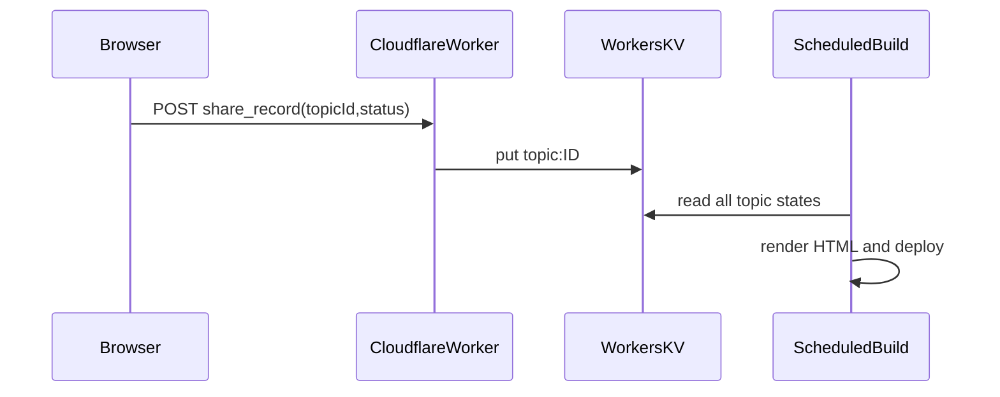

# Phase2: 「共有の記録」の永続化（Workers + KV 案）

現状の静的 HTML ではラジオの選択がブラウザ内だけで消えます。サンプルどおり **未対応バックログ** と **月次「共有した」集計** を実データで回すには、トピック ID ごとに `share_record` をサーバ側へ保存する必要があります。

## 推奨アーキテクチャ（最小）

1. **キー設計（KV）**  
   - `topic:{brief_date}:{topic_index}` → JSON `{"share_record":"pending|done_shared|done_skipped","updated_at":"ISO-8601"}`  
   - または `state:v1` に集約した JSON（小規模なら単一キーで十分）。

2. **Worker ルート**  
   - `POST /api/topics/{brief_date}/{topic_index}/share`  
     - Body: `{ "share_record": "done_shared" }`  
     - Access の背後に置き、**セッションまたはサービストークン**で CSRF／なりすましを防ぐ。
   - `GET /api/state` はビルドジョブ専用トークンで読み取り（Wrangler の `secrets` に保存）。

3. **日次ビルド**  
   - 現在の [brief_pipeline/build.py](../brief_pipeline/build.py) の前段で KV から `share_record` を読み、`record_brief_day` にマージしてから HTML を生成。  
   - 月次集計は `done_shared` のみカウントする既存ロジックをそのまま流用。

4. **フロント**  
   - 静的 HTML のラジオを `<form action="https://worker/...">` にするか、小さな `<script type="module">` で `fetch` し、成功時にトースト表示。

## 代替

- **Cloudflare D1**（SQL）で監査ログも残す。  
- **Netlify Blobs + Netlify Functions** 同様の 1 トピック 1 レコード更新。

## セキュリティ

- 書き込み API は必ず認証の背後（Access + サービスロール）に置く。  
- レート制限とバリデーション（許可された `brief_date` / `topic_index` のみ）。
